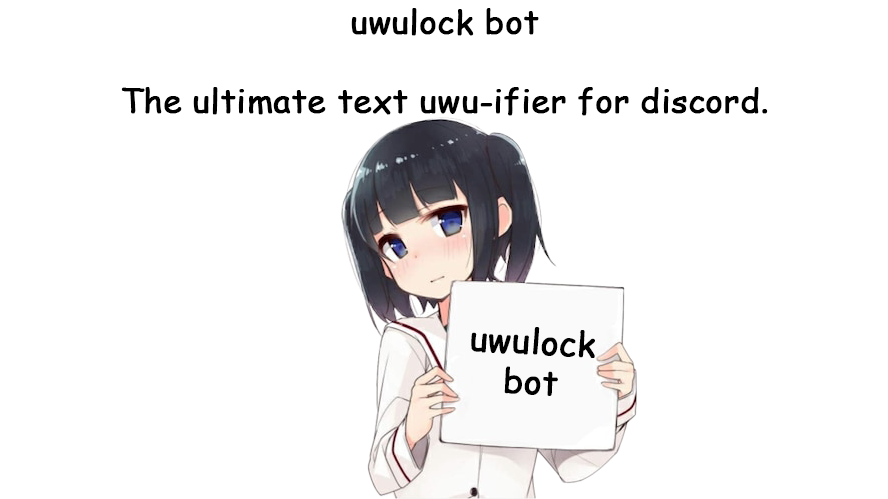

<p align="center">
  
</p>

# UwULock Bot 🔒💕

[](LICENSE)
[](https://www.python.org/)
[](https://discordpy.readthedocs.io/)

A fun Discord bot that "uwulocks" your friends. When a locked user sends a message, the bot deletes it and resends it in their name — uwuified — via webhook (the "APP" tag next to the message reveals it's a webhook).

> ⚠️ **Use responsibly**: This bot is for fun between friends. Only use it with people who are okay with it. Don't use it on servers you don't own or on people who haven't consented.

## Features

- Automatically **uwuifies** locked users' messages (l/r → w, stuttering, word swaps, emoji & action expressions)
- Protects **links, code blocks, mentions, and custom emojis** from being mangled
- Catches **message edits** too — editing won't escape the uwulock
- Bulk lock/unlock (`!uwulockall`, `!uwuunlockall`)
- **Leaderboard** (`!uwustats`) — see who's been uwulocked the most
- Bot **presence** shows how many people are currently locked
- All commands are **owner-only** (set via `OWNER_ID`)

## Setup

### 1. Create a Discord Bot

1. Go to https://discord.com/developers/applications → **New Application**.
2. Go to the **Bot** tab → **Reset Token** and copy your token (keep it secret!).
3. Under **Privileged Gateway Intents**, enable:
   - `MESSAGE CONTENT INTENT`
   - `SERVER MEMBERS INTENT`

### 2. Invite the Bot to Your Server

1. Go to **OAuth2 → URL Generator**.
2. **Scopes**: `bot`
3. **Bot Permissions**:
   - Manage Webhooks
   - Manage Messages
   - View Channels
   - Send Messages
   - Read Message History
   - Embed Links
   - Attach Files
4. Open the generated link and add the bot to your server.

### 3. Install Dependencies

```bash
pip install -r requirements.txt
```

Create a `.env` file in the same folder as `uwulock_bot.py`:

```
DISCORD_BOT_TOKEN=paste_your_bot_token_here
OWNER_ID=paste_your_own_id_here
```

**How to find your Discord user ID:**
1. Discord → Settings → Advanced → Enable **Developer Mode**.
2. Right-click your profile → **Copy User ID**.
3. Paste it as `OWNER_ID`.

### 4. Run

```bash
python uwulock_bot.py
```

## Commands (default prefix: `!`)

> ⚠️ All commands are **owner-only**. Other users get no response — they won't even know the commands exist.

| Command | Description |
|---|---|
| `!uwulock @user` | Uwulock a user — their messages will be uwuified |
| `!uwuunlock @user` (`!unlock @user`) | Release a user from uwulock |
| `!uwulockall` | Uwulock everyone in the server (bots and owner excluded) |
| `!uwuunlockall` | Release everyone at once |
| `!uwulist` | List currently locked users |
| `!uwuify <text>` | Test the uwuifier on any text |
| `!uwustats` | Show the UwU leaderboard |
| `!uwustatus <status>` | Change bot status: `online`, `idle`, `invisible`, `dnd` |
| `!uwuhelp` | Show command list |
| `!shutdown` | Shut the bot down completely |

## How It Works

- When a locked user sends a message, the bot deletes it and resends it through a webhook using their name and avatar — uwuified. The "APP" badge shows it's a webhook.
- Command messages (starting with `!`) are not uwuified, but only the owner gets responses — locked users can't unlock themselves.
- Links, `` `code blocks` ``, Discord mentions (`<@...>`, `<#...>`), custom emojis (`<:name:id>`), and timestamps (`<t:...>`) are **never modified**.
- If a locked user edits their message, the bot catches that too and replaces it with a uwuified version.
- The bot's presence (activity) shows how many users are currently locked across all servers: *"watching X people uwulocked 💕"*.
- `!uwustatus online|idle|invisible|dnd` changes the bot's Discord visibility. `invisible` makes it appear offline while still running.

## Data

Lock list and stats are stored in `uwulock_data.json` (created automatically). Format:

```json
{
  "locks": {"guild_id": [user_id, ...]},
  "stats": {"guild_id": {"user_id": uwu_count}}
}
```

This file is in `.gitignore` — your data stays local.

## Contributing

Pull requests are welcome! Good places to contribute:
- Adding words to `WORD_SUBSTITUTIONS`
- Adding expressions to `FACES`
- New commands or improvements

Open an issue before making large changes.

## License

This project is licensed under the [MIT License](LICENSE).

## Made with ❤️

By Ast
